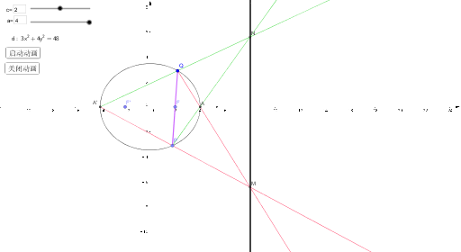

> These are some courseware for math and physics edited with Geogebra.

* Kramdown table of contents
{:toc .toc}

# Geogebra Courseware

Created 2017.02.01 by William Yu; Last modified: 2018.07.21-V1.0.3

Contact :[windmillyucong@163.com](mailto:windmillyucong@163.com)

Copyright ©2018 William Yu. All Rights Reserved.

----

## Description

These are some courseware for math and physics edited with Geogebra which can be helpful for students.

I have been graduated from high school for three years, while I still love mathematics so much, especially conic section. So I did these courseware to help my former math teacher to make his class more interesting.

#### 圆锥曲线平面截切3D演示

#### 椭圆性质之切线垂直于角平分线

#### 椭圆性质之切线性质之直角梯形构造轨迹为新椭圆

#### 椭圆性质之定点对称线与椭圆交点的连线斜率为定值

![4]./imgs/4.png)

#### 椭圆性质之椭圆切线与以长轴为直径的圆的交点到相应焦点的连线与椭圆切线垂直

#### 椭圆性质之焦点弦性质

#### 椭圆性质之过定点弦中点轨迹为新椭圆

#### 椭圆模板

#### 椭圆参数画法

#### 椭圆的等长定义画法

#### 平抛运动

#### 斜抛运动

## Download

You can [download Geogebra](https://www.geogebra.org/download) to see the detials of these coursewares.

